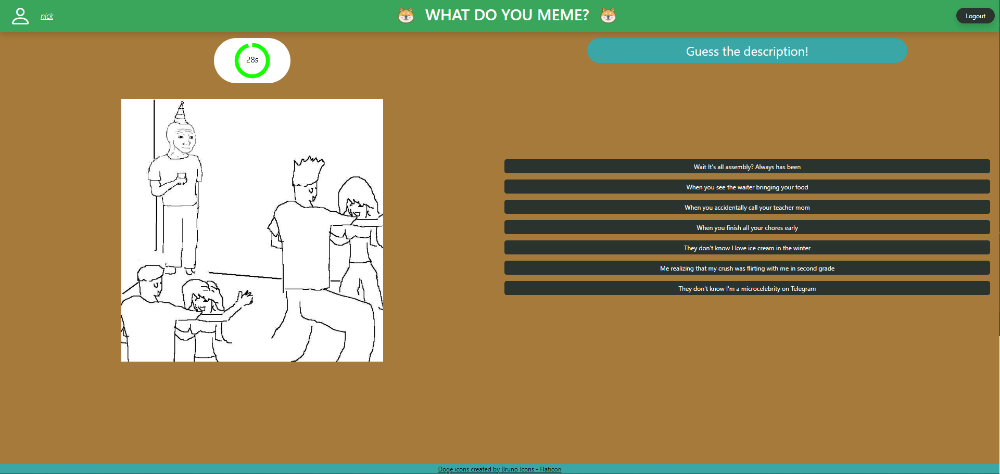

# Exam #1: "Gioco dei Meme"

## React Client Application Routes

- Route `/`: Home page, contains a welcome screen with the game's title (always present in the navbar) and a button to start a new game (if you are not logged in, there will be a second button to log in)

- Route `/login`: a login form with username and password fields and a button to submit the form. If you entered this page by trying to visiting the /profile route after the login is successful, you will be redirected to the /profile route

- Route `/profile`: page for the profile, shows on the top: the username, the numbers of game played, the maximum high score achieved and the total number of points accumulated in that profile.
  - Below there is a list of the games played in chronological order with the most recent first. Each game has a final score that shows the total number of points obtained in that game and the different rounds played with their different memes and scores.
  
- Route `/play`: the same route will have two modes based on the status of the user: loggedIn and not loggedIn:
  - Logged in: the user will see the meme and the captions, he will have to choose the correct caption to submit under the time limit (30 seconds). After the submission or the timeout, the user will see the score obtained in that round and the list of correct and wrong answers. The user will click the button with the text "Next Round" to go to the next round. This will repeat until the third round is completed, after which the user will see the final score obtained in that game with all the meme and caption correctly guessed and a button to go back to the home page.
  - Not Logged In: It is very similar to the logged in mode, but the user will have only one round and no final recap (as it already know the full game score). After the submission or the timeout, the user will see the score obtained in that round and the list of correct and wrong answers. The user will click the button with the text "Back to Home" to go back to the home page.

## API Server

- GET `/api/users/:username`
  - request parameters
    - username: string
  - response body content
    - id: integer
    - username: string

- GET `/api/games/history/:username`
  - request parameters:
    - username: string
      - the username of the user to get the games history
  - response body:
    - games: array of objects
      - id: integer
      - date: string
      - final_score: integer
      - rounds: array of object
        - roundId: integer
        - image: string
        - score: integer

Example:

``` json
[
  {
    "gameId": 4,
    "finalScore": 0,
    "date": "2024-06-26T11:02:36.000Z",
    "rounds": [
      {
        "id": 4,
        "score": 0,
        "memeImage": "meme2.jpg"
      },
      {
        "id": 5,
        "score": 0,
        "memeImage": "meme10.jpg"
      },
      {
        "id": 6,
        "score": 0,
        "memeImage": "meme9.jpg"
      }
    ]
  },
  ...
]
```

- GET `/api/games/new`
  - request parameters: none
  - response body content:
    - gameId: integer (-1 to avoid conflicts with the real game ids)
    - gameStatus: string (should always be "COMPLETED")
    - newRound: object
      - memeId: integer
      - image: string
      - captions: array of objects
        - captionId: integer
        - caption: string
        - score: integer

Example:

``` json
{
  "gameId": -1,
  "gameStatus": "COMPLETED",
  "newRound": {
    "memeId": 9,
    "image": "meme9.jpg",
    "captions": [
      {
        "captionId": 17,
        "caption": "Losing your head",
        "score": 5
      },
      ...
    ]
  }
}
```

- GET `/api/memes/:memeId/captions/:captionId`
  - request parameters
    - memeId: integer
    - captionId: integer
  - response body content
    - score: integer

Example of a right answer:

``` json
{
  "score": 5
}
```

- POST `/api/games/new`
  - request parameters and request body content:
    - score: integer
  - response body content
    - gameId: integer
    - lastScore: integer
    - gameStatus: string (should always be "IN_PROGRESS")
    - newRound: object
      - memeId: integer
      - image: string
      - captions: array of objects
        - captionId: integer
        - caption: string
        - score: integer

Example:

```json
{
  "gameId": 13,
  "lastScore": 0,
  "gameStatus": "IN_PROGRESS",
  "newRound": {
    "memeId": 9,
    "image": "meme9.jpg",
    "captions": [
      {
        "captionId": 17,
        "caption": "Losing your head",
        "score": 5
      },
      ...
    ]
  }
}
```

- POST `/api/games/next`
  - request parameters and request body content:
    - gameId: integer
    - memeSeen: array of integers (the memeId seen until now)
    - answer: object
      - memeId: integer
      - captionId: integer
      - timeout: boolean
  - response body content
    - gameId: integer
    - lastScore: integer
    - gameStatus: string
    - finalScore: integer (optional, present only if the game is completed)
    - newRound: object (optional, present only if the game is in progress)
      - memeId: integer
      - image: string
      - captions: array of objects
        - captionId: integer
        - caption: string
        - score: integer

Example of a response of the last round of a game:

```json
{
  "gameId": "13",
  "lastScore": 0,
  "gameStatus": "COMPLETED",
  "finalScore": 5
}
```

<!-- for login -->
- POST `/api/login`
  - request parameters and request body content
    - username: string
    - password: string
  - response body content
    - id: integer
    - username: string

- GET `/api/session`
  - request parameters: none
  - response body content
    - id: integer
    - username: string

<!-- logout -->
- DELETE `/api/session`
  - request parameters: none
  - response body content: none
  - response status code: 200

## Database Tables

- Table `users`
  - id INTEGER (primary key)
  - username TEXT NOT NULL (UNIQUE)
  - password TEXT NOT NULL
  - salt TEXT NOT NULL
  
- Table `memes`
  - id INTEGER (primary key)
  - file_name TEXT NOT NULL

- Table `captions`
  - id INTEGER (primary key)
  - text TEXT NOT NULL

- Table `meme_captions`
  - id INTEGER (primary key)
  - meme_id INTEGER (foreign key memes.id)
  - caption_id INTEGER (foreign key captions.id)
  - score INTEGER (0 or 5)

- Table `games`
  - id INTEGER (primary key)
  - user_id INTEGER (foreign key users.id)
  - date DATETIME NOT NULL
  - status TEXT NOT NULL (one of the two values: 'IN_PROGRESS', 'COMPLETED')
  - score INTEGER NOT NULL

- Table `rounds`
  - id INTEGER (primary key)
  - game_id INTEGER (foreign key games.id)
  - meme_caption_id INTEGER (foreign key meme_captions.id)
  - timeout BOOLEAN NOT NULL

## Main React Components

- `App` (in `App.jsx`): Contains the routing logic and the main components of the website
- `Home` (in `HomeComponent.jsx`): Landing page to welcome users and start a new game or to log in
- `Game` (in `GameComponents.jsx`): Main component of the website, it contains the logic to play the game and the different modes based on the status of the user
  - `RoundResults` (in `GameComponents.jsx`): Component to show the results of a round
  - `GameRecap` (in `GameComponents.jsx`): Component to show the results of a game
- `LoginForm` (in `AuthComponents.jsx`): Component to handle the login form and the login logic
- `ProfilePage` (in `ProfileComponent.jsx`): Contains the information of the user and the list of the games played

(only _main_ components, minor ones may be skipped)

## Screenshot

### A Game Round



### Result Screen After Round Ends


## Users Credentials

- username: `nick` password: `thebestpassword`
- username: `frank` password:`theworstpassword`
